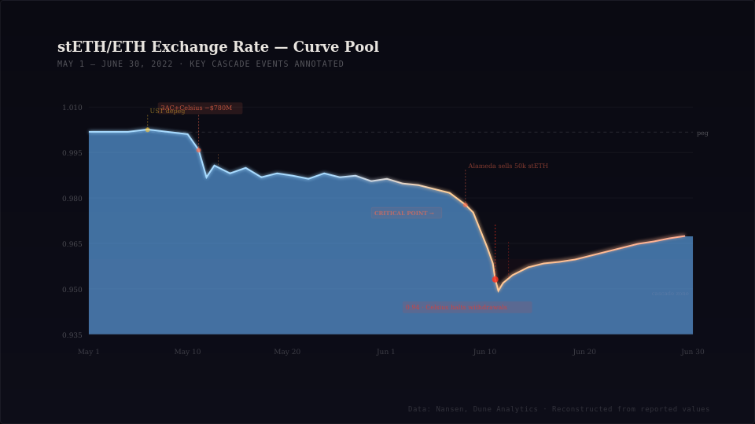
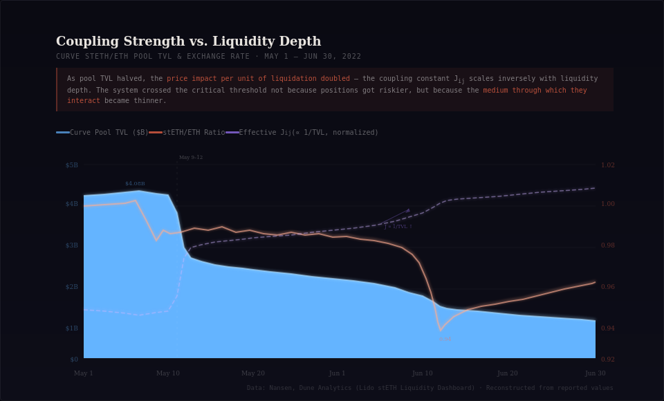
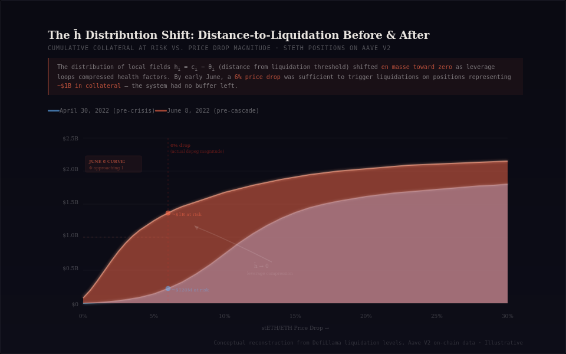

# Liquidation Cascades Are Phase Transitions, Not Black Swans

## 1. June 2022: A "Tail Event" That Wasn't

In the first two weeks of June 2022, the stETH/ETH peg on Curve broke to 0.94. Celsius held ~445,000 stETH — roughly \$1.4B at the time — but only ~132,000 stETH existed in the Curve pool to exit through. Three Arrows Capital had already pulled \$400M of liquidity from that same pool in a single transaction on May 12; Celsius pulled \$380M the same day. The Curve pool's TVL collapsed from \$4.08B to \$1.91B in three days.

stETH represented over 20% of Aave's total collateral. As the peg slipped, leveraged stETH/ETH loop positions — borrow ETH against stETH, stake it for more stETH, redeposit, repeat — began hitting Aave's 75% liquidation threshold. Each liquidation dumped stETH into an already-thin Curve pool, deepening the depeg, which pushed more positions underwater, which triggered more liquidations.

Every post-mortem called this contagion, a black swan, tail risk materializing. But there was nothing tail about it. The system was sitting on a **phase boundary**, and a small perturbation pushed it across a critical point. The physics to predict when this happens has existed since the 1970s.

---

## 2. Why Standard Risk Models Miss This

DeFi risk models inherit their assumptions from TradFi quantitative finance: prices evolve as continuous stochastic processes, utility landscapes are smooth and convex, and deviations from equilibrium are Gaussian. The standard approach treats a lending protocol's aggregate health as a smooth function of collateral prices — plug price paths into a Monte Carlo, compute Value-at-Risk, done.

This works when liquidations are isolated events: one position hits its threshold, gets liquidated, the market absorbs the impact, life continues. But a lending protocol with heterogeneous collateral types, discrete liquidation thresholds, and shared liquidity pools is not a continuous system. It is a **disordered lattice** — and it admits phase transitions that no smooth model can capture.

The correct framework is not stochastic calculus. It is statistical mechanics of disordered systems.

---

## 3. A Lending Protocol Is a Spin Glass

### 3.1 Defining the System

Consider a lending protocol with $N$ borrowing positions. Each position $i$ has:
- A collateral ratio $c_i(t)$ that fluctuates with market prices
- A liquidation threshold $\theta_i$ set by the protocol
- A binary state: **solvent** ($s_i = +1$) or **liquidated** ($s_i = -1$)

So far this is just accounting. The physics enters through the **interactions**. When position $i$ gets liquidated, its collateral is sold into shared liquidity pools, creating price impact that affects every other position holding correlated collateral. Define $J_{ij}$ as the coupling between positions $i$ and $j$ — the magnitude of the price impact that liquidating $i$ exerts on $j$'s health factor.

The system's total "energy" — or more precisely, its aggregate distress functional — can be written as:
$$H(\{s_i\}) = -\sum_{i<j} J_{ij}\, s_i\, s_j \;-\; \sum_i h_i\, s_i$$
where $h_i = c_i - \theta_i$ is the **local field**: how far position $i$ is from its liquidation threshold, independent of other positions. When $h_i > 0$, position $i$ is healthy; when $h_i < 0$, it's underwater.

This is the Hamiltonian of a disordered magnetic system. The first term captures position-to-position coupling through shared liquidity; the second captures each position's intrinsic health. The system's ground state — its lowest-energy configuration — corresponds to the "final state" after all cascades have resolved.

### 3.2 Why "Disordered"?

In a clean Ising model, all couplings $J_{ij}$ are identical. In our lending protocol, they are not. The couplings depend on:
- **Position sizes**: A whale's liquidation moves the market more than a minnow's
- **Collateral correlation**: Two positions both collateralized with stETH are strongly coupled; stETH vs. WBTC, much less so
- **Liquidity depth**: The same liquidation creates more price impact in a thin pool than a deep one
- **Liquidation bonuses**: Different protocols offer different incentives, creating heterogeneous liquidator behavior

The $J_{ij}$ are drawn from a complex, heterogeneous distribution — exactly the defining feature of a **spin glass**. This is not a metaphor. The mathematical structure is identical to the Sherrington-Kirkpatrick (SK) model:

$$J_{ij} \sim \mathcal{D}\left(\frac{J_0}{N},\, \frac{J^2}{N}\right)$$

where $\mathcal{D}$ denotes a distribution with mean $J_0/N$ and variance $J^2/N$, and the $1/N$ scaling ensures extensivity.

### 3.3 Frustration

The key property that makes spin glasses hard — and lending protocols dangerous — is **frustration**. Consider three positions, all collateralized with correlated assets. If positions 1 and 2 are liquidated, the price impact may be large enough to liquidate position 3. But if only position 1 is liquidated, the impact might be absorbed. The system's response depends on the *specific pattern* of which positions fail first — there is path dependence, and the final state is not unique.

In spin glass language: when the product of couplings around a loop satisfies $J_{12} J_{23} J_{31} < 0$, the loop is frustrated — there is no configuration that simultaneously minimizes all pairwise interactions. In the lending protocol, frustration arises whenever liquidation incentives conflict: a liquidator choosing to liquidate position A (for its bonus) may inadvertently stabilize position B but destabilize position C, while liquidating B first would have produced a completely different cascade path.

---

## 4. The Phase Transition: Deriving the Critical Condition

Now we derive when the system transitions from **absorbing isolated liquidations** to **cascading collapse** — the critical point the stETH market crossed in June 2022.

### 4.1 Mean-Field Self-Consistency

The coupling structure of a lending protocol is approximately **mean-field**: every position on Aave reads from the same oracle prices and trades into the same liquidity pools, so the effective interaction is all-to-all rather than nearest-neighbor. This is convenient — it means the Curie-Weiss / SK mean-field treatment is not an approximation but the natural description.

Define the **magnetization** $m = \frac{1}{N}\sum_i \langle s_i \rangle$, which measures the fraction of the system that is solvent. In our context, $m = 1$ means all positions are healthy; $m = -1$ means total liquidation.

In the paramagnetic (high-temperature) phase, we can expand the free energy to obtain the self-consistency equation. At inverse temperature $\beta$ (which parameterizes how sharply positions respond to approaching their thresholds), the magnetization satisfies:

$$m = \tanh\bigl(\beta(J_0\, m + \bar{h})\bigr)$$

where $\bar{h} = \frac{1}{N}\sum_i h_i$ is the average distance-to-liquidation across the protocol. This equation has a **unique solution** $m \approx 1$ (mostly solvent) when the coupling is weak relative to the local fields.

### 4.2 The Critical Point

The transition occurs when the self-consistency equation develops **multiple solutions** — the system can no longer sustain the "mostly solvent" state as the unique equilibrium.

Linearizing around $m \approx 1$ and analyzing stability, the critical condition is:

$$\beta\, J_0 = 1$$

or equivalently, the system enters the cascade regime when:

$$\frac{J_0}{\bar{h}} > \frac{1}{\beta\, \bar{h}}$$

In DeFi terms, this says: **a cascade becomes inevitable when the average coupling strength** (how much each liquidation moves the market) **exceeds the average buffer** (how far positions are from their thresholds), **scaled by the system's sensitivity**.

But this is the *ferromagnetic* transition — correlated failure in one direction. The spin glass transition introduces a second, more subtle critical point involving the **disorder**.

### 4.3 The Glass Transition

The Almeida-Thouless stability condition tells us when the "replica-symmetric" solution (the one where all cascade paths lead to the same outcome) becomes unstable. Below this line, the energy landscape fractures into exponentially many metastable states — the system's behavior becomes path-dependent and unpredictable.

The AT condition, translated to our setting, is:

$$\beta^2 J^2 \left(1 - q\right)^2 < 1$$

where $q = \frac{1}{N}\sum_i \langle s_i \rangle^2$ is the Edwards-Anderson **order parameter** measuring how "frozen" the system is. When this condition is **violated** — when $\beta^2 J^2 (1-q)^2 > 1$ — the system enters a **glassy phase** where:

1. The cascade outcome depends on *which* position gets liquidated first (path dependence)
2. There are many locally stable configurations, none of them globally optimal
3. Small perturbations can trigger avalanches between metastable states

This is the formal definition of what DeFi practitioners vaguely call "contagion" and "cascading liquidations." It is not a metaphor — it is a mathematically precise phase of matter.

---

## 5. Reading the Phase Diagram: stETH in June 2022

With this framework, we can retrospectively identify exactly how the stETH market drifted toward — and then across — the phase boundary.

**Decreasing $\bar{h}$ (average distance-to-liquidation):** The popular stETH/ETH leverage loop on Aave — deposit stETH, borrow ETH, stake for more stETH, repeat — systematically compressed health factors. With a max LTV of 73% and liquidation threshold at 75%, these positions were operating with ~2% buffer. As ETH prices declined 29% in the week of May 9–16, the distribution of $h_i$ shifted toward zero en masse.

**Increasing $J_0$ (average coupling strength):** The Curve stETH/ETH pool was the single liquidity venue for stETH exits. When its TVL halved from $4.08B to $1.91B, the price impact per unit of liquidation — the coupling constant $J_{ij}$ — approximately doubled. Every liquidation now moved the market twice as much.

**Increasing $J^2/J_0^2$ (disorder, relative variance of couplings):** The position size distribution was extremely heterogeneous. Celsius alone held 445k stETH against a Curve pool with 132k. The whale-to-pool ratio meant that the coupling distribution was fat-tailed — some liquidations would barely register, while a Celsius liquidation would be catastrophic. This drove the system toward the AT line.

The Chaos Labs simulation of this exact scenario captured the cascade dynamics with striking clarity: "when an account gets liquidated, its own health goes up, but driving other accounts' health down as the liquidation impacts the price." They observed that liquidations became unprofitable at a certain depth — the system had entered a regime where the cascade could not be resolved by the market mechanism alone, resulting in ~100k ETH of bad debt.

In phase diagram language: the system crossed *both* the ferromagnetic and the AT line simultaneously. It wasn't just a cascade — it was a **glassy** cascade, with path-dependent outcomes and no unique equilibrium.

---

## 6. Toward a Frustration Index

The critical conditions derived above suggest a measurable, on-chain quantity: a **Frustration Index** $\Phi$ that captures how close a lending protocol is to the cascade phase boundary.

The simplest formulation, directly from the mean-field analysis:

$$\Phi = \frac{\beta\, \text{Var}(J_{ij})}{\bar{h}^2}$$

This ratio captures the essential competition: coupling disorder (numerator) versus distance-to-criticality (denominator). Its inputs are all observable on-chain:

- **$\text{Var}(J_{ij})$** requires: the distribution of position sizes, the correlation matrix of collateral assets, and the liquidity depth of the relevant pools. All available from Aave's contracts, Curve/Uniswap pool states, and oracle feeds.
- **$\bar{h}$** requires: the distribution of health factors across all positions. Directly readable from Aave/Compound contracts.
- **$\beta$** (system sensitivity) can be estimated from historical liquidator response: how quickly liquidations are triggered once positions become eligible.

When $\Phi \ll 1$: the system is in the paramagnetic phase. Liquidations are isolated, absorbed, harmless.

When $\Phi \to 1$: the system approaches the AT line. This is the warning signal — the cascade phase boundary is near.

When $\Phi > 1$: the system is in the glass phase. Cascades are not just possible but structurally inevitable; the only question is which perturbation triggers them.

This is a proposal, not a finished product. The full formalization — including backtesting against historical cascade events, calibration of $\beta$, and a deployable on-chain monitor — belongs in the companion repository. But the theoretical foundation is exact: the Frustration Index is the natural order parameter for DeFi systemic risk, derived from first principles rather than fitted from data.

---

## 7. What's Next

This is one application of a broader framework. In follow-up articles:

- **MEV as Replica Symmetry Breaking**: The "fair ordering" problem is mathematically equivalent to finding the ground state of a frustrated spin glass — NP-hard in general. The Parisi order parameter has a direct interpretation as "overlap between competing block proposals."
- **Protocol Stability as Hopfield Memory Capacity**: A stablecoin "remembers" its peg through economic incentives. But like a Hopfield network, it has spurious states (depegs, death spirals) and capacity limits — the ratio of economic intents to validator capacity has a critical threshold analogous to $\alpha_c = 0.138$ in the Hopfield model.
- **Formal Verification**: If DeFi is a spin glass, how do we *prove* that a protocol avoids the dangerous metastable states? This is where Lean 4 formalization enters — verifying economic safety properties with the same rigor applied to mathematical theorems.

The companion GitHub repository with the full derivations, simulation code, and data analysis is here: [link].

---

**References & Data Sources**

- Nansen, "On-Chain Forensics: Demystifying stETH's De-peg" (2022)
- Chaos Labs, "AAVE Simulation Series: stETH:ETH Depeg" (2022)
- Dune Analytics: Aave stETH Liquidation Tracker, Lido stETH Liquidity Dashboard, DeFi Liquidations Mega Dashboard
- DefiLlama: Liquidation level data
- OECD, "DeFi Liquidations: Volatility and Liquidity" (2023)
- Qin et al., "An Empirical Study of DeFi Liquidations," ACM IMC (2021)
- Sherrington & Kirkpatrick, Phys. Rev. Lett. 35, 1792 (1975)
- de Almeida & Thouless, J. Phys. A 11, 983 (1978)

